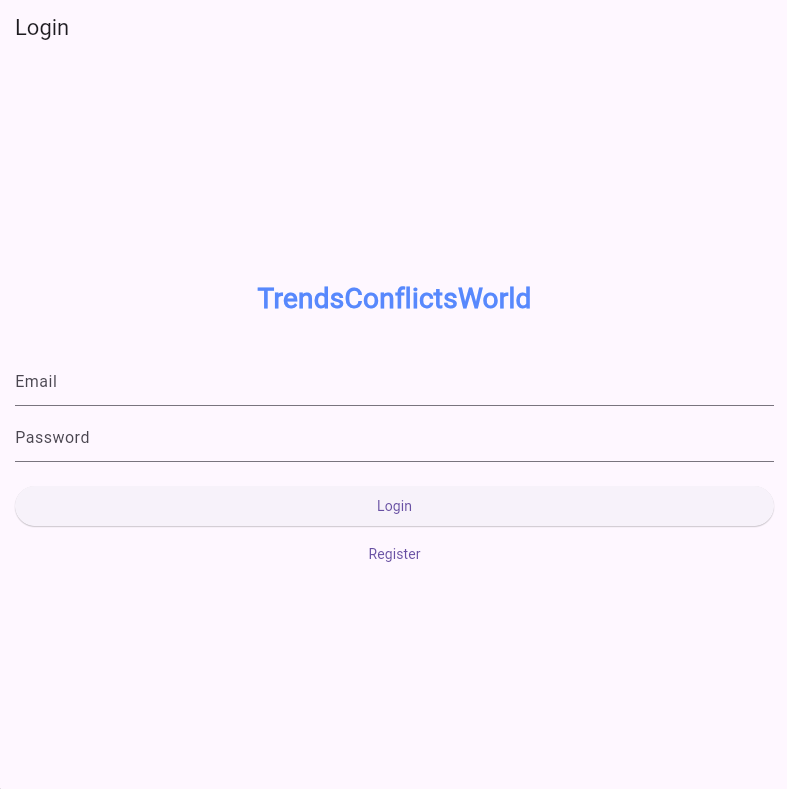
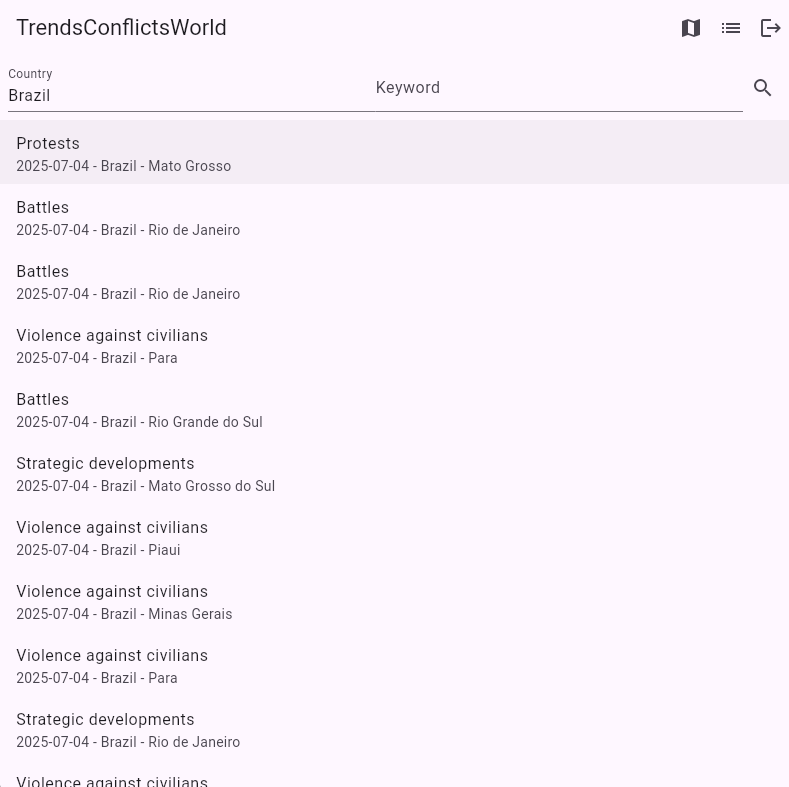
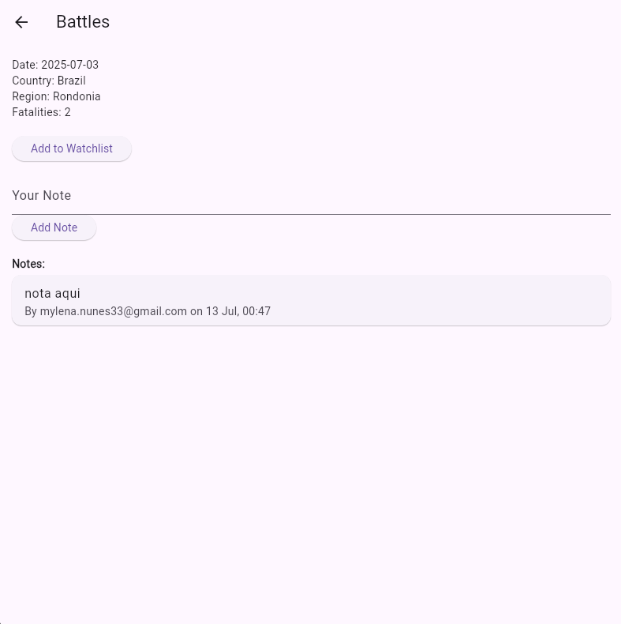
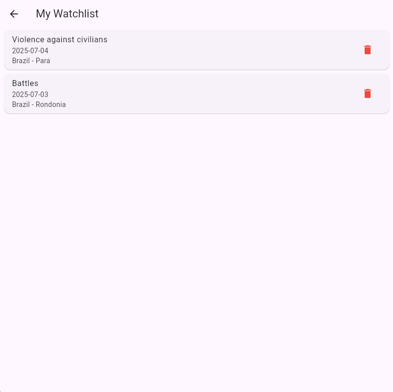

# TrendsConflictsWorld

[](https://flutter.dev)
[](https://firebase.google.com)
[](https://pub.dev/packages/get)

**TrendsConflictsWorld** é uma aplicação web e móvel desenvolvida em Flutter para monitorar, analisar e salvar eventos de conflito global. Utilizando dados em tempo real da [API pública ACLED](https://acleddata.com/), a aplicação permite que os usuários explorem conflitos, favoritem eventos de interesse e adicionem anotações pessoais.

---

## 📸 Telas do Aplicativo

| Tela de Login | Tela Inicial | Detalhes do Evento |
| :---: | :---: | :---: |
|  |  |  |
| **Watchlist** | **Mapa Interativo** | |
|  |  | |


---

## ✨ Funcionalidades Principais

- **Autenticação Segura:** Cadastro e login de usuários com E-mail/Senha, utilizando Firebase Authentication.
- **Busca de Conflitos:** Interface para buscar eventos de conflito por país e palavra-chave.
- **Mapa Interativo:** Visualização geoespacial dos eventos com marcadores e painéis de detalhes.
- **Watchlist Pessoal:** Sistema para favoritar eventos e criar uma lista de acompanhamento pessoal.
- **Anotações por Evento:** Permite que usuários adicionem múltiplos comentários isolados para cada evento em sua watchlist.

---

## 🛠️ Arquitetura e Tecnologias

O projeto foi construído seguindo uma arquitetura limpa e escalável, com uma clara separação de responsabilidades.

> **Gerenciamento de Estado:** GetX (seguindo o padrão MVC)
> **Backend (BaaS):** Firebase (Authentication, Cloud Firestore)
> **API de Dados:** ACLED (Armed Conflict Location & Event Data Project)
> **Mapas:** `flutter_map` com tiles do Mapbox

A estrutura do código está organizada em:
- `lib/app/controllers`: Lógica de negócio e estado.
- `lib/app/ui/pages`: Widgets da interface.
- `lib/app/routes`: Definições de navegação.
- `lib/app/bindings`: Inicialização de dependências.
- `lib/app/data/providers`: Acesso a dados externos.

---

## 🚀 Como Executar o Projeto

1.  **Clone o Repositório**
    ```bash
    git clone https://github.com/SEU-USUARIO/trendsconflictsworld.git
    cd trendsconflictsworld
    ```

2.  **Configure o Firebase**
    - Crie um novo projeto no [console do Firebase](https://console.firebase.google.com/).
    - Ative o **Authentication** (com "E-mail/Senha") e o **Cloud Firestore**.
    - Na aba **Authentication > Settings > Authorized domains**, adicione o domínio do seu ambiente de desenvolvimento web.
    - Configure seu projeto para Flutter usando o [FlutterFire CLI](https://firebase.flutter.dev/docs/cli):
      ```bash
      flutterfire configure
      ```

3.  **Configure as Chaves de API (Arquivo `.env`)**
    - Copie o arquivo `.env.example` para um novo arquivo chamado `.env`:
      ```bash
      cp .env.example .env
      ```
    - Abra o arquivo `.env` e preencha com suas chaves secretas da ACLED e do Mapbox.

4.  **Instale as Dependências**
    ```bash
    flutter pub get
    ```

5.  **Execute o Aplicativo**
    ```bash
    flutter run
    ```
